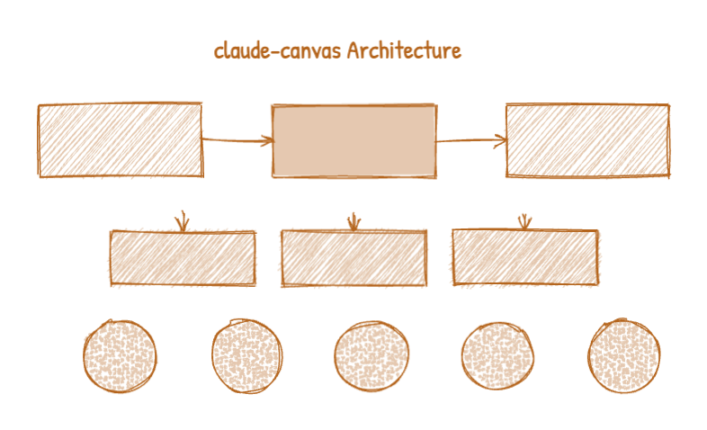

<p align="center">
  
</p>

<h1 align="center">claude-canvas</h1>

<p align="center">
  <strong>A shared visual canvas for Claude Code — draw diagrams, wireframes, and flowcharts, then ask visual questions and get answers.</strong>
</p>

<p align="center">
  <a href="https://www.npmjs.com/package/claude-canvas"></a>
  <a href="https://github.com/uditalias/claude-canvas/blob/main/LICENSE"></a>
  <a href="https://nodejs.org"></a>
  <a href="https://www.typescriptlang.org"></a>
  <a href="https://github.com/uditalias/claude-canvas"></a>
  <a href="https://www.npmjs.com/package/claude-canvas"></a>
  <a href="https://github.com/uditalias/claude-canvas/issues"></a>
</p>

<p align="center">
  <a href="#installation">Installation</a> &bull;
  <a href="#quick-start">Quick Start</a> &bull;
  <a href="#cli-reference">CLI Reference</a> &bull;
  <a href="#visual-qa">Visual Q&A</a> &bull;
  <a href="#interactive-canvas">Interactive Canvas</a> &bull;
  <a href="#claude-code-skill">Claude Code Skill</a> &bull;
  <a href="#architecture">Architecture</a>
</p>

---

## What is claude-canvas?

**claude-canvas** gives [Claude Code](https://claude.ai/code) a visual canvas. It runs a local server that opens a browser-based drawing surface where Claude can send draw commands (shapes, arrows, text, freehand paths) via CLI or HTTP API, and users can draw interactively too. Communication happens in real-time over WebSocket.

It also serves as a **visual Q&A tool** — Claude can send structured questions alongside canvas drawings, and users answer by picking options, typing text, or drawing directly on the canvas.

<p align="center">
  
</p>

### Key Features

- **Sketchy hand-drawn aesthetic** — powered by [Rough.js](https://roughjs.com), all shapes render with a natural, whiteboard feel
- **Bidirectional drawing** — Claude draws via CLI/API, users draw interactively in the browser
- **Visual Q&A system** — ask structured questions with per-question canvas drawings, collect answers programmatically
- **Multiple fill styles** — hachure, solid, zigzag, cross-hatch, dots, dashed, and wireframe outlines
- **Session management** — run multiple isolated canvas sessions simultaneously
- **Real-time sync** — WebSocket-powered instant updates between CLI and browser
- **Export options** — save as PNG, SVG, or JSON
- **Claude Code skill** — install the skill so Claude automatically knows when and how to use the canvas

<p align="center">
  
</p>

### How It Works

1. **`claude-canvas start`** launches a local Express + WebSocket server and opens a browser tab
2. **Claude Code** sends draw commands and questions via the CLI (which hits the HTTP API)
3. The **server broadcasts** commands to the browser over WebSocket in real-time
4. **Users interact** directly on the canvas — drawing, answering questions, or annotating Claude's work
5. **`claude-canvas screenshot`** captures the canvas state and returns answers to any pending questions

---

## Installation

### Via npm (recommended)

```bash
npm install -g claude-canvas
```

### From source

```bash
git clone https://github.com/uditalias/claude-canvas.git
cd claude-canvas
npm install
npm run build
npm link  # makes `claude-canvas` available globally
```

### Requirements

- **Node.js** >= 18
- A modern browser (Chrome, Firefox, Safari, Edge)

---

## Quick Start

**1. Start a canvas session:**

```bash
claude-canvas start
```

This opens a browser tab with a fresh canvas and returns session info:

```json
{"sessionId": "a1b2c3d4", "port": 7890, "url": "http://127.0.0.1:7890", "pid": 1234}
```

**2. Draw something:**

```bash
claude-canvas draw '{"commands": [
  {"type": "rect", "x": 50, "y": 50, "width": 200, "height": 100, "label": "Frontend"},
  {"type": "rect", "x": 350, "y": 50, "width": 200, "height": 100, "label": "Backend"},
  {"type": "arrow", "x1": 250, "y1": 100, "x2": 350, "y2": 100, "label": "API"}
]}'
```

**3. Take a screenshot:**

```bash
claude-canvas screenshot
```

```json
{"ok": true, "path": "/tmp/claude-canvas/canvas-123.png", "answers": []}
```

**4. Stop the session when done:**

```bash
claude-canvas stop --all
```

---

## CLI Reference

All commands accept `-s, --session <id>`. You can omit it when only one session is running.

### Session Management

| Command | Description |
|---------|-------------|
| `claude-canvas start` | Start a new canvas session (opens browser) |
| `claude-canvas start -p 8080` | Start on a specific port |
| `claude-canvas stop -s <id>` | Stop a specific session |
| `claude-canvas stop --all` | Stop all running sessions |

### Drawing

```bash
# Send draw commands as JSON
claude-canvas draw '{"commands": [...]}'

# Read from stdin (useful for large payloads)
echo '{"commands": [...]}' | claude-canvas draw -

# Render instantly without animation
claude-canvas draw --no-animate '{"commands": [...]}'
```

### Canvas Operations

| Command | Description |
|---------|-------------|
| `claude-canvas clear` | Clear all objects from the canvas |
| `claude-canvas clear --layer claude` | Clear only Claude's objects (keep user drawings) |
| `claude-canvas screenshot` | Capture canvas as PNG and collect Q&A answers |
| `claude-canvas export -f png` | Export as PNG |
| `claude-canvas export -f svg` | Export as SVG |
| `claude-canvas export -f json` | Export as JSON |
| `claude-canvas export -f png --labels` | Export with shape labels included |

<details>
<summary><strong>DrawCommand Types</strong> (click to expand)</summary>

#### Shapes

All support optional `label`, `color`, `opacity`, and `fillStyle`:

```jsonc
// Rectangle
{"type": "rect", "x": 50, "y": 50, "width": 200, "height": 120, "label": "Header"}

// Circle
{"type": "circle", "x": 200, "y": 200, "radius": 60, "label": "Node"}

// Ellipse
{"type": "ellipse", "x": 300, "y": 150, "width": 180, "height": 100}
```

#### Lines and Arrows

```jsonc
// Line
{"type": "line", "x1": 100, "y1": 100, "x2": 300, "y2": 100}

// Arrow (with directional head)
{"type": "arrow", "x1": 100, "y1": 200, "x2": 300, "y2": 200, "label": "flow"}
```

#### Text

```jsonc
// textAlign: "left" | "center" | "right"
{"type": "text", "x": 200, "y": 50, "content": "Title", "fontSize": 24, "textAlign": "center"}
```

#### Freehand

```jsonc
{"type": "freehand", "points": [[10, 10], [50, 30], [90, 10], [130, 30]]}
```

#### Groups and Connectors

For structured flowcharts:

```jsonc
// Group: bundle shapes under an ID for connectors
{"type": "group", "id": "box-a", "commands": [
  {"type": "rect", "x": 200, "y": 30, "width": 140, "height": 60},
  {"type": "text", "x": 270, "y": 50, "content": "Start", "textAlign": "center"}
]}

// Connector: auto-routes between group edges
{"type": "connector", "from": "box-a", "to": "box-b", "label": "next"}
```

</details>

### Fill Styles

Shapes default to `"hachure"`. Set `fillStyle` on any shape:

| Style | Description |
|-------|-------------|
| `hachure` | Hand-drawn diagonal lines (default) |
| `solid` | Solid fill |
| `zigzag` | Zigzag pattern |
| `cross-hatch` | Cross-hatched lines |
| `dots` | Dotted pattern |
| `dashed` | Dashed lines |
| `zigzag-line` | Zigzag line pattern |
| `none` | No fill (wireframe outline only) |

---

## Visual Q&A

The Q&A system lets Claude send structured questions with visual context. A floating panel appears in the browser where users can answer by clicking options, typing text, or drawing.

<p align="center">
  
</p>

Users select answers via interactive pill buttons. Selected answers are highlighted:

<p align="center">
  
</p>

### Sending Questions

```bash
claude-canvas ask '{"questions": [
  {
    "id": "q1",
    "text": "Which layout do you prefer?",
    "type": "single",
    "options": ["Layout A", "Layout B", "Layout C"],
    "commands": [
      {"type": "rect", "x": 80, "y": 80, "width": 200, "height": 150, "label": "Layout A"},
      {"type": "rect", "x": 350, "y": 80, "width": 200, "height": 150, "label": "Layout B"}
    ]
  },
  {
    "id": "q2",
    "text": "What should the title be?",
    "type": "text"
  }
]}'
```

### Question Types

| Type | Description | User interaction | Answer format |
|------|------------|------------------|---------------|
| `single` | Pick one option | Radio-style pill buttons | `"value": "Option A"` |
| `multi` | Pick multiple options | Toggle pill buttons | `"value": ["Option A", "Option C"]` |
| `text` | Free text input | Text field | `"value": "user's text"` |
| `canvas` | Draw on canvas | Freeform drawing | `"value": "see canvas"` + snapshot PNG |

### Collecting Answers

After sending questions, call `screenshot` to retrieve answers:

```bash
claude-canvas screenshot
```

```json
{
  "ok": true,
  "path": "/tmp/claude-canvas/canvas-123.png",
  "answers": [
    {"questionId": "q1", "value": "Layout A"},
    {"questionId": "q2", "value": "My Custom Title"}
  ]
}
```

For `canvas`-type questions, Claude draws a diagram and the user responds by drawing directly on the canvas. The answer includes a snapshot of what the user drew:

<p align="center">
  
</p>

```json
{"questionId": "q3", "value": "see canvas", "canvasSnapshot": "/tmp/claude-canvas/canvas-q3-456.png"}
```

---

## Interactive Canvas

The browser canvas is a full interactive drawing surface, not just a display. Users can draw alongside Claude's shapes in real-time.

### Drawing Tools

The toolbar provides these drawing tools:

| Tool | Description |
|------|-------------|
| Rectangle | Draw rectangles with optional fill |
| Circle | Draw circles |
| Line | Draw straight lines |
| Arrow | Draw directional arrows |
| Freehand | Freeform pencil drawing |
| Text | Click to place text |
| Paint | Brush painting with adjustable size |

### Canvas Features

- **Zoom & Pan** — scroll to zoom, drag to pan the canvas
- **Undo/Redo** — full history support (up to 50 states)
- **Snap Guides** — alignment guides appear when moving objects near other objects
- **Context Menu** — right-click any shape to change color, fill, opacity, label, lock, or layer order
- **Color Palette** — soft muted color presets with custom color picker
- **Brush Size** — adjustable size for paint and freehand tools
- **Dark Mode** — respects system theme preference
- **Keyboard Shortcuts** — quick tool switching via keyboard

### Layer System

Objects have a layer property:
- **`user`** — shapes drawn interactively in the browser
- **`claude`** — shapes drawn via the CLI/API

Use `claude-canvas clear --layer claude` to remove Claude's drawings without affecting user drawings.

---

## Claude Code Skill

Install the included skill so Claude Code automatically knows when and how to use the canvas.

### Installation

```bash
cp src/skill/claude-canvas.md ~/.claude/skills/
```

Or if installed globally via npm:

```bash
cp $(npm root -g)/claude-canvas/dist/skill/claude-canvas.md ~/.claude/skills/
```

### What the Skill Does

Once installed, Claude Code will automatically use the canvas when it makes sense — for example:

- Drawing architecture diagrams during system design discussions
- Sketching UI wireframes when discussing layouts
- Creating flowcharts to explain processes
- Presenting visual options and asking for your preference via Q&A

You don't need to explicitly tell Claude to use the canvas. The skill teaches Claude when the canvas is the right tool for the job.

---

## Architecture

```
                    ┌─────────────────┐
                    │  Claude Code    │
                    │  (CLI / Skill)  │
                    └────────┬────────┘
                             │ HTTP API
                    ┌────────▼────────┐
                    │  Express Server │
                    │  + WebSocket    │
                    └────────┬────────┘
                             │ WebSocket
                    ┌────────▼────────┐
                    │  Browser Canvas │
                    │  React + Fabric │
                    └─────────────────┘
```

<p align="center">
  
</p>

<details>
<summary><strong>Project Structure</strong> (click to expand)</summary>

```
src/
├── bin/claude-canvas.ts      # CLI entry point (Commander)
├── server/
│   ├── router.ts             # REST API endpoints
│   ├── websocket.ts          # WebSocket server
│   ├── state.ts              # In-memory state & broadcast
│   └── process.ts            # Session management (PID/port)
├── client/
│   ├── components/
│   │   ├── Canvas.tsx        # Main canvas view
│   │   ├── Toolbox.tsx       # Drawing toolbar
│   │   ├── QuestionPanel.tsx # Q&A floating panel
│   │   ├── Hud.tsx           # Connection status & zoom
│   │   └── ContextMenu.tsx   # Right-click context menu
│   ├── hooks/
│   │   ├── useCanvas.ts      # Fabric.js canvas + rough.js rendering
│   │   ├── useDrawingTools.ts# Interactive drawing tools
│   │   ├── useWebSocket.ts   # WS connection + auto-reconnect
│   │   ├── useToolState.ts   # Tool selection + shortcuts
│   │   ├── useUndoRedo.ts    # Canvas history (50 states)
│   │   ├── useSnapGuides.ts  # Alignment snap guides
│   │   └── useQuestionPanel.ts# Q&A state management
│   └── lib/
│       └── rough-line.ts     # Custom Fabric objects for rough.js
├── protocol/
│   └── types.ts              # Shared types (DrawCommand, WsMessage, etc.)
└── skill/
    └── claude-canvas.md      # Claude Code skill definition
```

</details>

---

## Development

```bash
# Clone the repository
git clone https://github.com/uditalias/claude-canvas.git
cd claude-canvas
npm install

# Run in development mode (server with hot reload)
npm run dev

# Run client only (Vite dev server on :5173, proxies to :7890)
npm run dev:client

# Build everything
npm run build

# Run unit tests
npm test

# Run E2E tests (requires build first)
npm run build && npx playwright test
```

---

## Examples

<details>
<summary><strong>Architecture Diagram</strong></summary>

```bash
claude-canvas draw '{"commands": [
  {"type": "text", "x": 400, "y": 40, "content": "System Architecture", "fontSize": 28, "textAlign": "center"},
  {"type": "rect", "x": 50, "y": 100, "width": 180, "height": 80, "label": "Client App", "fillStyle": "hachure"},
  {"type": "rect", "x": 310, "y": 100, "width": 180, "height": 80, "label": "API Gateway", "fillStyle": "solid"},
  {"type": "rect", "x": 570, "y": 100, "width": 180, "height": 80, "label": "Database", "fillStyle": "dots"},
  {"type": "arrow", "x1": 230, "y1": 140, "x2": 310, "y2": 140, "label": "REST"},
  {"type": "arrow", "x1": 490, "y1": 140, "x2": 570, "y2": 140, "label": "SQL"}
]}'
```

</details>

<details>
<summary><strong>Wireframe Layout</strong></summary>

```bash
claude-canvas draw '{"commands": [
  {"type": "rect", "x": 50, "y": 30, "width": 500, "height": 60, "label": "Navigation", "fillStyle": "none"},
  {"type": "rect", "x": 50, "y": 110, "width": 150, "height": 300, "label": "Sidebar", "fillStyle": "none"},
  {"type": "rect", "x": 220, "y": 110, "width": 330, "height": 300, "label": "Main Content", "fillStyle": "none"}
]}'
```

</details>

<details>
<summary><strong>Flowchart with Connectors</strong></summary>

```bash
claude-canvas draw '{"commands": [
  {"type": "group", "id": "start", "commands": [
    {"type": "rect", "x": 200, "y": 30, "width": 140, "height": 60},
    {"type": "text", "x": 270, "y": 50, "content": "Start", "textAlign": "center"}
  ]},
  {"type": "group", "id": "process", "commands": [
    {"type": "rect", "x": 200, "y": 150, "width": 140, "height": 60},
    {"type": "text", "x": 270, "y": 170, "content": "Process", "textAlign": "center"}
  ]},
  {"type": "group", "id": "end", "commands": [
    {"type": "rect", "x": 200, "y": 270, "width": 140, "height": 60},
    {"type": "text", "x": 270, "y": 290, "content": "End", "textAlign": "center"}
  ]},
  {"type": "connector", "from": "start", "to": "process"},
  {"type": "connector", "from": "process", "to": "end"}
]}'
```

</details>

<details>
<summary><strong>Visual Decision Making (Q&A)</strong></summary>

```bash
claude-canvas ask '{"questions": [
  {
    "id": "theme",
    "text": "Which color theme should we use?",
    "type": "single",
    "options": ["Blue Ocean", "Forest Green", "Sunset Purple"],
    "commands": [
      {"type": "circle", "x": 150, "y": 150, "radius": 50, "label": "Blue", "fillStyle": "solid"},
      {"type": "circle", "x": 350, "y": 150, "radius": 50, "label": "Green", "fillStyle": "solid"},
      {"type": "circle", "x": 550, "y": 150, "radius": 50, "label": "Purple", "fillStyle": "solid"}
    ]
  },
  {
    "id": "name",
    "text": "What should we name this feature?",
    "type": "text"
  },
  {
    "id": "features",
    "text": "Which features should we include?",
    "type": "multi",
    "options": ["Dark mode", "Animations", "Keyboard shortcuts", "Mobile support"]
  }
]}'
```

</details>

---

## Tips

- The visible canvas area is roughly **1200 x 800 pixels** — place shapes within this range
- Use `label` on shapes for clarity — labels float above shapes as text overlays
- Use `textAlign: "center"` with text inside groups to center text within boxes
- For groups, place the text `x` at the center of the rect (`rect.x + rect.width / 2`)
- After drawing, call `screenshot` to capture and verify what the user sees
- Use `clear --layer claude` to remove Claude's drawings without erasing user drawings
- Connectors automatically route between group edges — just specify `from` and `to` group IDs
- Pass `color` as a hex string for custom colors: `"color": "#D4726A"`

---

## Contributing

Contributions are welcome! Please feel free to submit a [Pull Request](https://github.com/uditalias/claude-canvas/pulls).

1. Fork the repository
2. Create your feature branch (`git checkout -b feature/amazing-feature`)
3. Commit your changes (`git commit -m 'Add amazing feature'`)
4. Push to the branch (`git push origin feature/amazing-feature`)
5. Open a Pull Request

---

## License

This project is licensed under the MIT License — see the [LICENSE](LICENSE) file for details.

---

<p align="center">
  Built with &#10024; by <a href="https://github.com/uditalias">Udi Talias</a>
</p>
