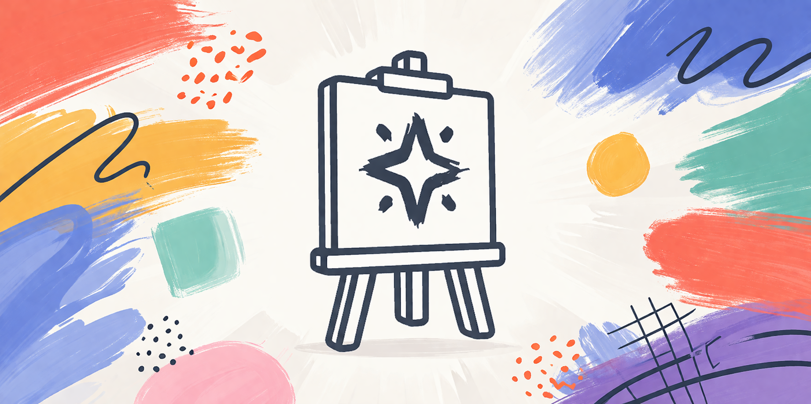
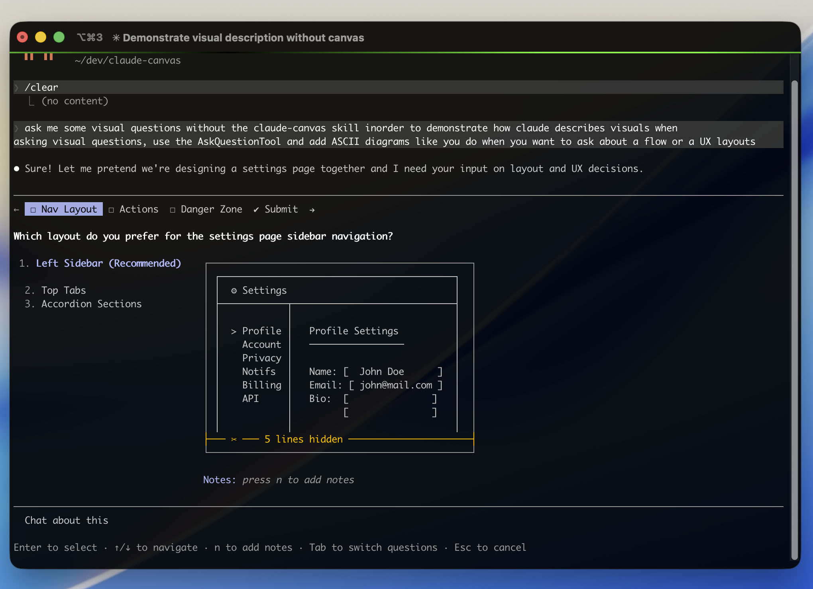
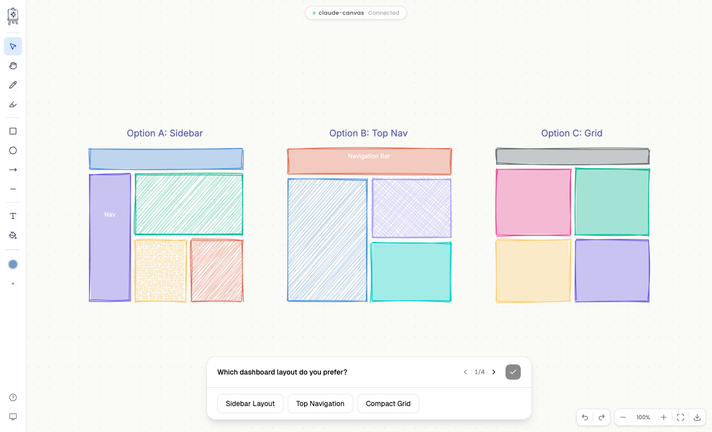
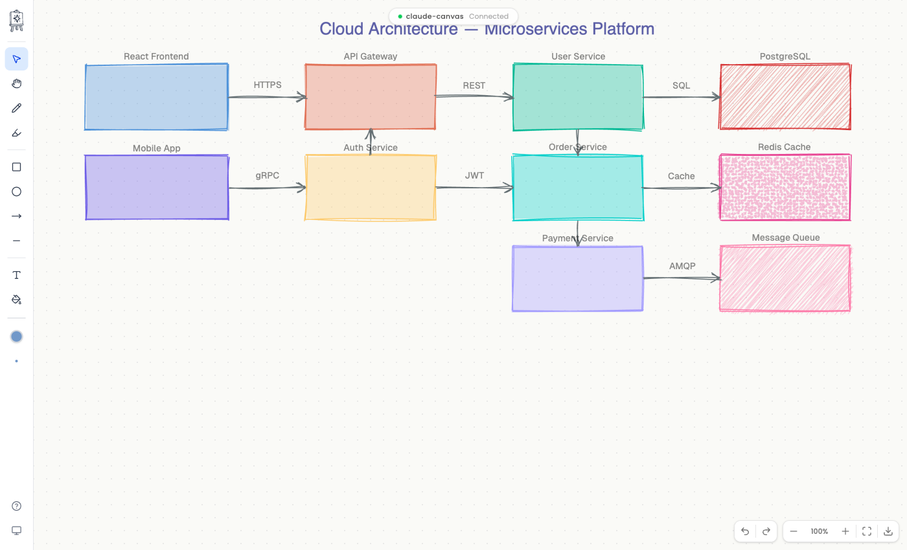
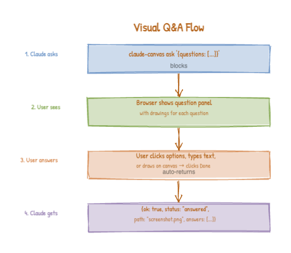
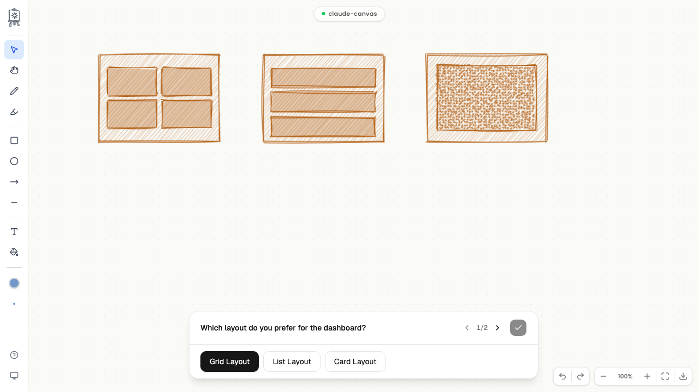
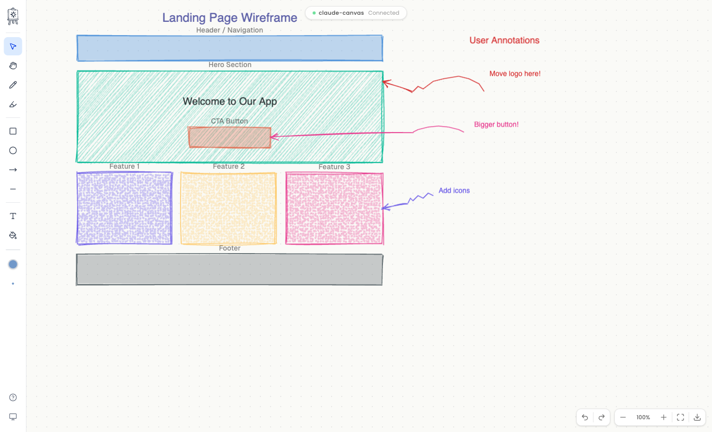
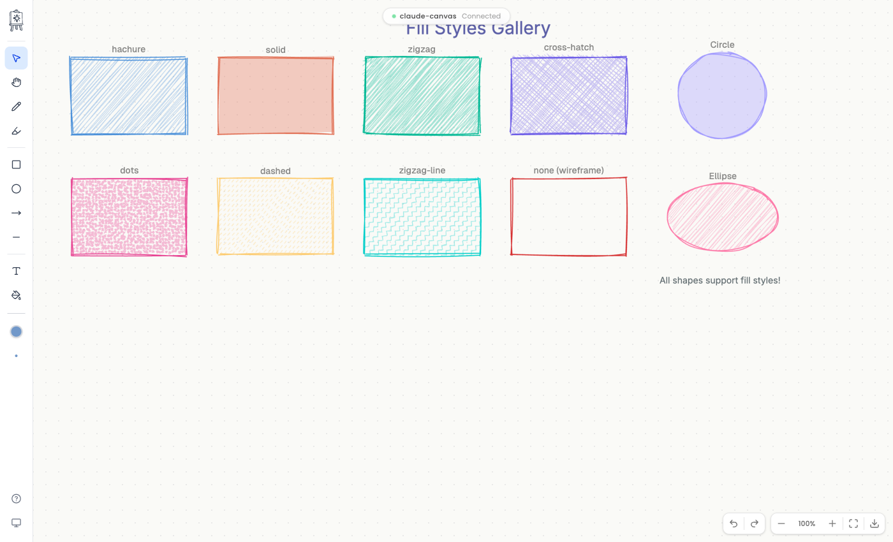
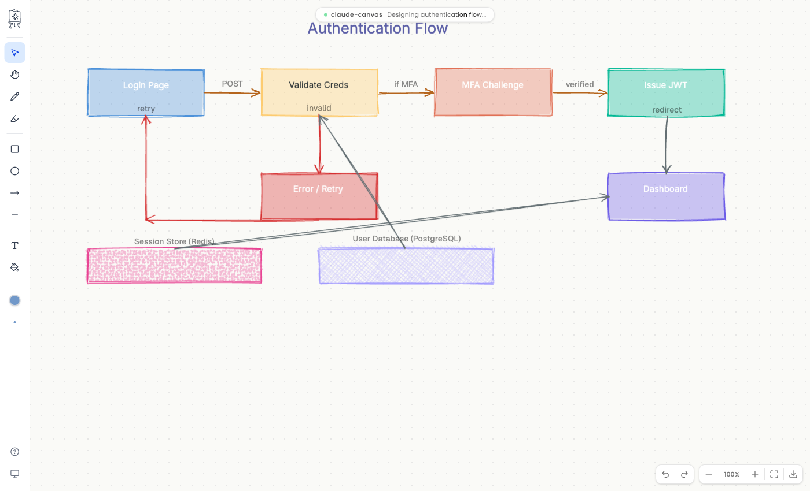
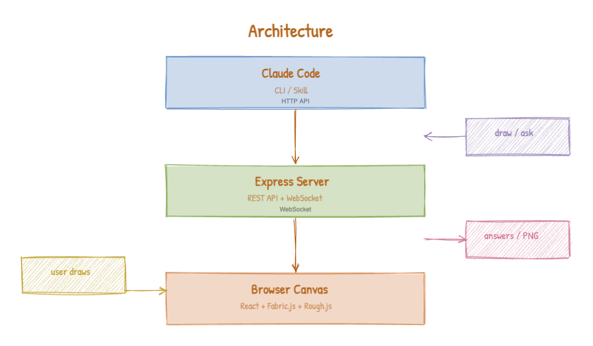

<p align="center">
  
</p>

<h1 align="center">claude-canvas</h1>

<p align="center">
  <strong>Give Claude Code eyes and a whiteboard. Install the skill, start a session, and Claude automatically draws diagrams, wireframes, and mockups on a shared canvas — asking visual questions and collecting your feedback instead of cluttering the terminal.</strong>
</p>

<p align="center">
  <a href="https://github.com/uditalias/claude-canvas/actions/workflows/test.yml"></a>
  <a href="https://www.npmjs.com/package/claude-canvas"></a>
  <a href="https://github.com/uditalias/claude-canvas/blob/main/LICENSE"></a>
  <a href="https://nodejs.org"></a>
</p>

<p align="center">
  <a href="#installation">Installation</a> &bull;
  <a href="#quick-start">Quick Start</a> &bull;
  <a href="#visual-qa--ask">Visual Q&A</a> &bull;
  <a href="#drawing">Drawing</a> &bull;
  <a href="#dsl-format">DSL Format</a> &bull;
  <a href="#interactive-canvas">Interactive Canvas</a> &bull;
  <a href="#claude-code-skill">Claude Code Skill</a> &bull;
  <a href="#cli-reference">CLI Reference</a>
</p>

---

## What is claude-canvas?

[Claude Code](https://claude.ai/code) is powerful, but it's stuck in text. When Claude needs to show you a layout, compare design options, or ask "which of these do you prefer?" — a terminal isn't enough.

**claude-canvas** is a shared visual canvas for Claude Code. Once installed, Claude **automatically** draws diagrams, sketches wireframes, and asks visual questions on the canvas — you just answer by clicking, typing, or drawing in the browser. You don't run any drawing commands yourself; the included **Claude Code skill** teaches Claude when and how to use the canvas.

<table align="center" width="100%">
  <tr>
    <td align="center"><strong>Without Claude Canvas</strong></td>
    <td align="center"><strong>With Claude Canvas</strong></td>
  </tr>
  <tr>
    <td width="50%" align="center"></td>
    <td align="center"></td>
  </tr>
</table>

### What it solves

- **"Which layout do you prefer?"** — Claude draws the options on canvas, you click your choice
- **"What should this look like?"** — Claude sketches a wireframe, you annotate it
- **"Here's the architecture"** — Claude draws a diagram you can actually see, not ASCII art
- **"Name this feature"** — Claude shows context on canvas, you type your answer

### How It Works

1. **Install & setup** — `npm install -g claude-canvas && claude-canvas setup`
2. **Talk to Claude** — just use Claude Code as you normally would
3. **Claude opens the canvas** — when visuals would help, Claude starts a session and opens a browser tab automatically
4. **Claude draws** — diagrams, wireframes, and mockups appear on the canvas
5. **You respond** — answer visual questions by clicking, typing, or drawing in the browser
6. **Claude continues** — your answers flow back to Claude automatically

> **You never need to run any `claude-canvas` commands yourself.** The skill handles everything — Claude calls the CLI under the hood using a compact [DSL](#dsl-format) that minimizes token usage.

### Key Features

- **Fully automatic** — the Claude Code skill teaches Claude when and how to use the canvas; no manual commands needed
- **Visual Q&A** — structured questions with per-question canvas drawings, answers returned automatically
- **Shared drawing surface** — Claude draws on the canvas, you draw interactively in the browser, both in real-time
- **Compact DSL** — a concise drawing language that uses 3-5x fewer tokens than JSON, with auto-layout and label-based arrow routing ([reference](src/skill/claude-canvas/DSL-REFERENCE.md))
- **Hand-drawn aesthetic** — powered by [Rough.js](https://roughjs.com), everything looks like a natural whiteboard sketch
- **Multiple fill styles** — hachure, solid, zigzag, cross-hatch, dots, dashed, and wireframe outlines
- **Status badge** — Claude updates a live status message in the browser so you always know what it's working on
- **Export** — save as PNG, SVG, or JSON

<p align="center">
  
</p>

---

## Installation

### Via npm (recommended)

```bash
npm install -g claude-canvas
claude-canvas setup
```

The `setup` command installs the Claude Code skill, which lets Claude automatically use the canvas when it makes sense.

### Updating

```bash
claude-canvas update
```

This checks for the latest version, installs it, and automatically updates the Claude Code skill if it has changed.

### From source

```bash
git clone https://github.com/uditalias/claude-canvas.git
cd claude-canvas
npm install
npm run build
npm link  # makes `claude-canvas` available globally
claude-canvas setup
```

### Requirements

- **Node.js** >= 18
- A modern browser (Chrome, Firefox, Safari, Edge)

---

## Quick Start

**1. Install and set up the skill:**

```bash
npm install -g claude-canvas
claude-canvas setup
```

**2. Use Claude Code as normal:**

That's it. When visuals would help — architecture diagrams, wireframe comparisons, design decisions — Claude will automatically start a canvas session, open a browser tab, and draw there instead of cluttering the terminal.

For example, ask Claude to *"design a dashboard layout"* or *"show me the system architecture"*. Claude will open the canvas, draw the diagrams, and if it needs your input, a question panel will appear in the browser for you to answer.

---

## Visual Q&A / Ask

The core feature of claude-canvas. When Claude needs your input on a visual decision, it draws options on the canvas and presents a floating question panel in your browser. You answer by clicking options, typing text, or drawing — then click Done. Claude receives your answers automatically and continues working.

> You don't run the `ask` command yourself — Claude calls it via the skill. The examples below show what Claude sends under the hood.

### The Flow

<p align="center">
  
</p>

<p align="center">
  
</p>

Users select answers via interactive pill buttons. Selected answers are highlighted:

<p align="center">
  
</p>

### Example (what Claude sends)

```bash
# Claude uses the DSL format to minimize token usage:
claude-canvas ask --dsl 'ask {
  question #q1 single "Which layout do you prefer?" {
    options "Layout A" | "Layout B" | "Layout C"
    row gap=40 {
      box "Layout A" 200x150 fill=none
      box "Layout B" 200x150 fill=none
    }
  }
  question #q2 text "What should the title be?"
}'
```

### Question Types

| Type | Description | User interaction | Answer format |
|------|------------|------------------|---------------|
| `single` | Pick one option | Radio-style pill buttons | `"value": "Option A"` |
| `multi` | Pick multiple options | Toggle pill buttons | `"value": ["Option A", "Option C"]` |
| `text` | Free text input | Text field | `"value": "user's text"` |
| `canvas` | Draw on canvas | Freeform drawing | `"value": "see canvas"` + snapshot PNG |

### Response

The `ask` command blocks until you click Done, then Claude receives:

```json
{
  "ok": true,
  "status": "answered",
  "path": "/tmp/claude-canvas/canvas-123.png",
  "answers": [
    {"questionId": "q1", "value": "Layout A"},
    {"questionId": "q2", "value": "My Custom Title"}
  ]
}
```

If the browser disconnects before the user submits:

```json
{
  "ok": false,
  "status": "disconnected",
  "error": "Browser disconnected before answers were submitted"
}
```

### Canvas-Type Answers

For `canvas`-type questions, Claude draws a diagram and you respond by drawing directly on the canvas. The answer includes a snapshot of what you drew:

<p align="center">
  
</p>

```json
{"questionId": "q3", "value": "see canvas", "canvasSnapshot": "/tmp/claude-canvas/canvas-q3-456.png"}
```

---

## Drawing

Claude draws shapes, diagrams, and wireframes on the canvas automatically when visuals would help. The skill instructs Claude to use a compact [DSL format](#dsl-format) for all drawing, which reduces token usage by 3-5x compared to JSON.

> You don't run `draw` commands yourself — Claude calls them via the skill. The examples below show what Claude sends under the hood.

```bash
# What Claude sends (DSL):
claude-canvas draw --dsl 'row gap=40 {
  box "Frontend" 200x100
  box "Backend" 200x100
}
arrow "Frontend" -> "Backend" "API"'
```

<p align="center">
  
</p>

<details>
<summary><strong>DrawCommand Types</strong> (click to expand)</summary>

#### Shapes

All support optional `label`, `color`, `opacity`, and `fillStyle`:

```jsonc
// Rectangle
{"type": "rect", "x": 50, "y": 50, "width": 200, "height": 120, "label": "Header"}

// Circle
{"type": "circle", "x": 200, "y": 200, "radius": 60, "label": "Node"}

// Ellipse
{"type": "ellipse", "x": 300, "y": 150, "width": 180, "height": 100}
```

#### Lines and Arrows

```jsonc
// Line
{"type": "line", "x1": 100, "y1": 100, "x2": 300, "y2": 100}

// Arrow (with directional head)
{"type": "arrow", "x1": 100, "y1": 200, "x2": 300, "y2": 200, "label": "flow"}
```

#### Text

```jsonc
// textAlign: "left" | "center" | "right"
{"type": "text", "x": 200, "y": 50, "content": "Title", "fontSize": 24, "textAlign": "center"}
```

#### Freehand

```jsonc
{"type": "freehand", "points": [[10, 10], [50, 30], [90, 10], [130, 30]]}
```

#### Groups and Connectors

For structured flowcharts:

```jsonc
// Group: bundle shapes under an ID for connectors
{"type": "group", "id": "box-a", "commands": [
  {"type": "rect", "x": 200, "y": 30, "width": 140, "height": 60},
  {"type": "text", "x": 270, "y": 50, "content": "Start", "textAlign": "center"}
]}

// Connector: auto-routes between group edges
{"type": "connector", "from": "box-a", "to": "box-b", "label": "next"}
```

</details>

<details>
<summary><strong>Fill Styles</strong> (click to expand)</summary>

Shapes default to `"hachure"`. Set `fillStyle` on any shape:

| Style | Description |
|-------|-------------|
| `hachure` | Hand-drawn diagonal lines (default) |
| `solid` | Solid fill |
| `zigzag` | Zigzag pattern |
| `cross-hatch` | Cross-hatched lines |
| `dots` | Dotted pattern |
| `dashed` | Dashed lines |
| `zigzag-line` | Zigzag line pattern |
| `none` | No fill (wireframe outline only) |

</details>

## DSL Format

claude-canvas includes a concise DSL (domain-specific language) for drawing commands. The Claude Code skill instructs Claude to **always use the DSL** instead of JSON — it's **3-5x fewer tokens**, which keeps conversations within context limits during complex visual sessions.

The DSL handles **automatic layout** via `row` and `stack` containers (no manual coordinate math) and supports **label-based arrow routing** (reference shapes by name instead of pixel positions). Claude uses these features automatically — you don't need to know the DSL syntax yourself.

### Why DSL?

```bash
# DSL — 2 lines, auto-layout, no coordinates (what Claude sends)
claude-canvas draw --dsl 'row gap=40 { box "Frontend" 200x100; box "Backend" 200x100 }
arrow "Frontend" -> "Backend" "API"'

# JSON equivalent — 5 lines, manual x/y for every shape
claude-canvas draw '{"commands": [
  {"type": "rect", "x": 50, "y": 50, "width": 200, "height": 100, "label": "Frontend"},
  {"type": "rect", "x": 350, "y": 50, "width": 200, "height": 100, "label": "Backend"},
  {"type": "arrow", "x1": 250, "y1": 100, "x2": 350, "y2": 100, "label": "API"}
]}'
```

### DSL examples (what Claude generates)

```bash
# Shapes with layout
claude-canvas draw --dsl 'row gap=40 {
  box "Web App" 180x80 fill=solid color=#7198C9
  box "API" 180x80 fill=solid color=#8AAD5A
  box "DB" 180x80 fill=solid color=#D9925E
}
arrow "Web App" -> "API" "REST"
arrow "API" -> "DB" "SQL"'

# Flowchart with connectors
claude-canvas draw --dsl '
group #start { box "Start" 140x60 }
group #process { box "Process" 140x60 }
group #end { box "End" 140x60 }
#start -> #process
#process -> #end'

# Visual Q&A
claude-canvas ask --dsl 'ask {
  question #theme single "Which color theme?" {
    options "Blue Ocean" | "Forest Green" | "Sunset Purple"
    row gap=40 {
      circle "Blue" 50 fill=solid color=#7198C9
      circle "Green" 50 fill=solid color=#8AAD5A
      circle "Purple" 50 fill=solid color=#9B85B5
    }
  }
  question #name text "What should we name this feature?"
}'
```

For the full DSL syntax — shapes, layout containers, attributes, and more examples — see the [DSL Reference](src/skill/claude-canvas/DSL-REFERENCE.md). This reference is also included in the skill, so other LLMs that read it can use claude-canvas the same way.

---

## Interactive Canvas

The browser canvas is a full interactive drawing surface, not just a display. You can draw alongside Claude's shapes in real-time — annotate diagrams, sketch alternatives, or respond to canvas-type questions.

### Drawing Tools

The toolbar provides these drawing tools:

| Tool | Description |
|------|-------------|
| Rectangle | Draw rectangles with optional fill |
| Circle | Draw circles |
| Line | Draw straight lines |
| Arrow | Draw directional arrows |
| Freehand | Freeform pencil drawing |
| Text | Click to place text |
| Paint | Brush painting with adjustable size |

### Canvas Features

- **Zoom & Pan** — scroll to zoom, drag to pan the canvas
- **Undo/Redo** — full history support (up to 50 states)
- **Snap Guides** — alignment guides appear when moving objects near other objects
- **Context Menu** — right-click any shape to change color, fill, opacity, label, lock, or layer order
- **Color Palette** — soft muted color presets with custom color picker
- **Brush Size** — adjustable size for paint and freehand tools
- **Dark Mode** — respects system theme preference
- **Keyboard Shortcuts** — quick tool switching via keyboard

### Layer System

Objects have a layer property:
- **`user`** — shapes drawn interactively in the browser
- **`claude`** — shapes drawn via the CLI/API

Use `claude-canvas clear --layer claude` to remove Claude's drawings without affecting user drawings.

---

## Claude Code Skill

The skill is what makes everything automatic. It teaches Claude Code **when** to use the canvas and **how** to call the CLI — you don't need to learn any commands.

### Installation

```bash
claude-canvas setup
```

This installs (or updates) the skill to `~/.claude/skills/claude-canvas/`. You can also install it manually:

```bash
cp -r $(npm root -g)/claude-canvas/src/skill/claude-canvas ~/.claude/skills/
```

### What the Skill Does

Once installed, Claude Code will automatically use the canvas when it makes sense — for example:

- Drawing architecture diagrams during system design discussions
- Sketching UI wireframes when discussing layouts
- Creating flowcharts to explain processes
- Presenting visual options and asking for your preference via Q&A

The skill instructs Claude to use the **DSL format** for all draw and ask commands, which uses 3-5x fewer tokens than JSON. This keeps conversations within context limits during complex visual sessions. The [DSL Reference](src/skill/claude-canvas/DSL-REFERENCE.md) is bundled with the skill so Claude (and other LLMs that read the skill files) can use the full DSL syntax.

You don't need to tell Claude to use the canvas — the skill handles that. Just have a conversation, and Claude will reach for the canvas when visuals would help.

---

## CLI Reference

> The CLI is what Claude (and other LLMs) call under the hood. You typically only need `start`, `stop`, and `setup`. The `draw`, `ask`, `screenshot`, and other commands are called automatically by the skill.

All commands accept `-s, --session <id>`. You can omit it when only one session is running.

| Command | Description |
|---------|-------------|
| `claude-canvas start` | Start a new canvas session (opens browser) |
| `claude-canvas start -p 8080` | Start on a specific port |
| `claude-canvas list` | List all running sessions |
| `claude-canvas stop -s <id>` | Stop a specific session |
| `claude-canvas stop --all` | Stop all running sessions |
| `claude-canvas ask '<json>'` | Send visual questions (JSON), block until answered |
| `claude-canvas ask --dsl '<dsl>'` | Send visual questions (DSL), block until answered |
| `claude-canvas draw '<json>'` | Send draw commands (JSON) |
| `claude-canvas draw --dsl '<dsl>'` | Send draw commands (DSL) |
| `claude-canvas draw --no-animate '<json\|dsl>'` | Draw without animation |
| `claude-canvas clear` | Clear all objects from the canvas |
| `claude-canvas clear --layer claude` | Clear only Claude's objects |
| `claude-canvas status '<text>'` | Update status badge in browser |
| `claude-canvas screenshot` | Capture canvas as PNG |
| `claude-canvas export -f png\|svg\|json` | Export canvas in various formats |
| `claude-canvas setup` | Install/update the Claude Code skill |
| `claude-canvas update` | Update to the latest version |

Both `ask` and `draw` accept `-` to read from stdin. Use `--dsl` for the compact DSL format (see [DSL Reference](src/skill/claude-canvas/DSL-REFERENCE.md)).

### Status Badge

Claude updates a live status message in the browser so you always know what it's working on:

<p align="center">
  
</p>

---

## Architecture

<p align="center">
  
</p>

<details>
<summary><strong>Project Structure</strong> (click to expand)</summary>

```
src/
├── bin/claude-canvas.ts      # CLI entry point (Commander)
├── server/
│   ├── router.ts             # REST API endpoints
│   ├── websocket.ts          # WebSocket server
│   ├── state.ts              # In-memory state & broadcast
│   └── process.ts            # Session management (PID/port)
├── client/
│   ├── components/
│   │   ├── Canvas.tsx        # Main canvas view
│   │   ├── Toolbox.tsx       # Drawing toolbar
│   │   ├── QuestionPanel.tsx # Q&A floating panel
│   │   ├── Hud.tsx           # Connection status & zoom
│   │   └── ContextMenu.tsx   # Right-click context menu
│   ├── hooks/
│   │   ├── useCanvas.ts      # Fabric.js canvas + rough.js rendering
│   │   ├── useDrawingTools.ts# Interactive drawing tools
│   │   ├── useWebSocket.ts   # WS connection + auto-reconnect
│   │   ├── useToolState.ts   # Tool selection + shortcuts
│   │   ├── useUndoRedo.ts    # Canvas history (50 states)
│   │   ├── useSnapGuides.ts  # Alignment snap guides
│   │   └── useQuestionPanel.ts# Q&A state management
│   └── lib/
│       └── rough-line.ts     # Custom Fabric objects for rough.js
├── protocol/
│   └── types.ts              # Shared types (DrawCommand, WsMessage, etc.)
└── skill/
    └── claude-canvas.md      # Claude Code skill definition
```

</details>

---

## Development

```bash
# Clone the repository
git clone https://github.com/uditalias/claude-canvas.git
cd claude-canvas
npm install

# Run in development mode (server with hot reload)
npm run dev

# Run client only (Vite dev server on :5173, proxies to :7890)
npm run dev:client

# Build everything
npm run build

# Run unit tests
npm test

# Run E2E tests (requires build first)
npm run build && npx playwright test
```

---

## Examples

> These show the commands Claude generates automatically via the skill. You don't need to write these yourself — they're here for reference and for other LLMs reading this documentation.

<details>
<summary><strong>Architecture Diagram (DSL)</strong></summary>

```bash
claude-canvas draw --dsl '
text "System Architecture" size=28 weight=bold align=center
row gap=40 {
  box "Client App" 180x80
  box "API Gateway" 180x80 fill=solid
  box "Database" 180x80 fill=dots
}
arrow "Client App" -> "API Gateway" "REST"
arrow "API Gateway" -> "Database" "SQL"
'
```

</details>

<details>
<summary><strong>Architecture Diagram (JSON)</strong></summary>

```bash
claude-canvas draw '{"commands": [
  {"type": "text", "x": 400, "y": 40, "content": "System Architecture", "fontSize": 28, "textAlign": "center"},
  {"type": "rect", "x": 50, "y": 100, "width": 180, "height": 80, "label": "Client App", "fillStyle": "hachure"},
  {"type": "rect", "x": 310, "y": 100, "width": 180, "height": 80, "label": "API Gateway", "fillStyle": "solid"},
  {"type": "rect", "x": 570, "y": 100, "width": 180, "height": 80, "label": "Database", "fillStyle": "dots"},
  {"type": "arrow", "x1": 230, "y1": 140, "x2": 310, "y2": 140, "label": "REST"},
  {"type": "arrow", "x1": 490, "y1": 140, "x2": 570, "y2": 140, "label": "SQL"}
]}'
```

</details>

<details>
<summary><strong>Wireframe Layout (DSL)</strong></summary>

```bash
claude-canvas draw --dsl '
stack gap=10 {
  box "Navigation" 500x60 fill=none
  row gap=10 {
    box "Sidebar" 150x300 fill=none
    box "Main Content" 330x300 fill=none
  }
}
'
```

</details>

<details>
<summary><strong>Wireframe Layout (JSON)</strong></summary>

```bash
claude-canvas draw '{"commands": [
  {"type": "rect", "x": 50, "y": 30, "width": 500, "height": 60, "label": "Navigation", "fillStyle": "none"},
  {"type": "rect", "x": 50, "y": 110, "width": 150, "height": 300, "label": "Sidebar", "fillStyle": "none"},
  {"type": "rect", "x": 220, "y": 110, "width": 330, "height": 300, "label": "Main Content", "fillStyle": "none"}
]}'
```

</details>

<details>
<summary><strong>Flowchart with Connectors (DSL)</strong></summary>

```bash
claude-canvas draw --dsl '
group #start { box "Start" 140x60 }
group #process { box "Process" 140x60 }
group #end { box "End" 140x60 }
#start -> #process
#process -> #end
'
```

</details>

<details>
<summary><strong>Flowchart with Connectors (JSON)</strong></summary>

```bash
claude-canvas draw '{"commands": [
  {"type": "group", "id": "start", "commands": [
    {"type": "rect", "x": 200, "y": 30, "width": 140, "height": 60},
    {"type": "text", "x": 270, "y": 50, "content": "Start", "textAlign": "center"}
  ]},
  {"type": "group", "id": "process", "commands": [
    {"type": "rect", "x": 200, "y": 150, "width": 140, "height": 60},
    {"type": "text", "x": 270, "y": 170, "content": "Process", "textAlign": "center"}
  ]},
  {"type": "group", "id": "end", "commands": [
    {"type": "rect", "x": 200, "y": 270, "width": 140, "height": 60},
    {"type": "text", "x": 270, "y": 290, "content": "End", "textAlign": "center"}
  ]},
  {"type": "connector", "from": "start", "to": "process"},
  {"type": "connector", "from": "process", "to": "end"}
]}'
```

</details>

<details>
<summary><strong>Visual Decision Making — Q&A (DSL)</strong></summary>

```bash
claude-canvas ask --dsl '
ask {
  question #theme single "Which color theme should we use?" {
    options "Blue Ocean" | "Forest Green" | "Sunset Purple"
    row gap=40 {
      circle "Blue" 50 fill=solid color=#7198C9
      circle "Green" 50 fill=solid color=#8AAD5A
      circle "Purple" 50 fill=solid color=#9B85B5
    }
  }
  question #name text "What should we name this feature?"
  question #features multi "Which features should we include?" {
    options "Dark mode" | "Animations" | "Keyboard shortcuts" | "Mobile support"
  }
}
'
```

</details>

<details>
<summary><strong>Visual Decision Making — Q&A (JSON)</strong></summary>

```bash
claude-canvas ask '{"questions": [
  {
    "id": "theme",
    "text": "Which color theme should we use?",
    "type": "single",
    "options": ["Blue Ocean", "Forest Green", "Sunset Purple"],
    "commands": [
      {"type": "circle", "x": 150, "y": 150, "radius": 50, "label": "Blue", "fillStyle": "solid"},
      {"type": "circle", "x": 350, "y": 150, "radius": 50, "label": "Green", "fillStyle": "solid"},
      {"type": "circle", "x": 550, "y": 150, "radius": 50, "label": "Purple", "fillStyle": "solid"}
    ]
  },
  {
    "id": "name",
    "text": "What should we name this feature?",
    "type": "text"
  },
  {
    "id": "features",
    "text": "Which features should we include?",
    "type": "multi",
    "options": ["Dark mode", "Animations", "Keyboard shortcuts", "Mobile support"]
  }
]}'
```

</details>

---

## Tips

- **No setup beyond install** — Claude starts and stops canvas sessions automatically
- **You can draw too** — use the toolbar to annotate Claude's diagrams or sketch your own ideas
- **Canvas-type questions** — when Claude asks a `canvas` question, draw your answer directly on the canvas
- **Export your work** — use `claude-canvas export -f png|svg|json` to save diagrams
- **Multiple sessions** — each `start` creates an isolated session; use `claude-canvas list` to see them all

---

## Contributing

Contributions are welcome! Please feel free to submit a [Pull Request](https://github.com/uditalias/claude-canvas/pulls).

1. Fork the repository
2. Create your feature branch (`git checkout -b feature/amazing-feature`)
3. Commit your changes (`git commit -m 'Add amazing feature'`)
4. Push to the branch (`git push origin feature/amazing-feature`)
5. Open a Pull Request

---

## License

This project is licensed under the MIT License — see the [LICENSE](LICENSE) file for details.

---

<p align="center">
  Built with &#10024; by <a href="https://github.com/uditalias">Udi Talias</a>
</p>
